# 01 仓库地址

github：https://github.com/lele-561/pm-project

gitee：https://gitee.com/wang-luyi/pm-project

# 02 接口文档地址

https://apifox.com/apidoc/shared-2f467264-9543-4113-a4c2-9573501c9396

# 03 部署说明

## 本地运行

改vue.config.js和api.js

### vue.config.js

本地使用诸如apifox调试时，配置该文件实现本地运行时端口的切换和mock后端api的接收

```js
module.exports = {
    devServer: {
        port: 8090, // npm run serve时前端开在的端口
        host: '0.0.0.0',
        // 跨域1：基本没用
        // proxy: "http://localhost:8080"
        // proxy: "http://127.0.0.1:4523/m1/1428114-0-default"
        // 跨域2：通常用这个
        proxy: {
            '/api': {
                // target: 'http://localhost:8080/',            // 后端url，如果调试时本地运行真实后端，使用这个，改为后端url
                target: 'http://127.0.0.1:4523/m1/1428114-0-default',   //  mock用，使用诸如apifox时，使用这个，改为mock的url
                ws: true,
                changeOrigin: true,
                pathRewrite: {
                    "^/api": ""
                }
            }
        },
    },
    lintOnSave: false,
    publicPath: "./"
}
```

### src/utils/api.js

```js
let base = '/api';  // 本地开发时，使用mock的api或真实后端api时
let base = 'http://127.0.0.1:4523/m1/1428114-0-default' // 本地开发时，使用mock的api
```

## 部署到服务器
实验室的1080电脑地址：http://59.78.194.93，访问需连接学校vpn

改api.js并配置nginx的nginx.conf文件

然后运行nginx.exe即可

### src/utils/api.js：

```js
let base = 'http://59.78.194.93:8090/api';  // 部署url，记得带api
```

然后打包得到dist文件

### nginx.conf

1080上的不用改，如果配新的要改，内容如下：

```conf
worker_processes  1;

events {
    worker_connections  1024;
}

http {	# 一些保证文件上传速度以及等待返回结果的配置
    include       mime.types;
    default_type  application/octet-stream;
    keepalive_timeout 300s; 
    proxy_connect_timeout 300s;
    proxy_send_timeout 300s; 
    proxy_read_timeout 300s; 
    fastcgi_connect_timeout 300s; 
    fastcgi_send_timeout 300s; 
    fastcgi_read_timeout 300s;
    proxy_buffering off;
    proxy_request_buffering off;
    client_max_body_size 100m;
    client_body_buffer_size 20m;
    sendfile on;
    tcp_nopush on;
    tcp_nodelay on;

	# nginx本来的配置
    server {
        listen       80;
        server_name  localhost;
        location / {
            root   html;
            index  index.html index.htm;
        }
        error_page   500 502 503 504  /50x.html;
        location = /50x.html {
            root   html;
        }
    }
    
	# 新增一个代理
    server {
        listen 8090; # 前端开在的端口
        server_name 0.0.0.0;
        autoindex on;
        index index.html index.htm index.php;
        root D:\前端文件\颗粒物\dist; # 前端打包文件位置

        location ^~/api/ { #改写前端发的url中带的api
      		proxy_pass http://localhost:8080/; # 后端url，改端口号就行
        }
    }
}
```

# 04 前端工程各文件说明

## public

### index.html

这里是标签页上的系统名：

```html
<title>SP-MAC</title>
```

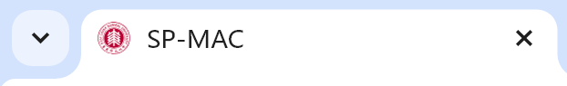

## src

### lang 多语言切换

用于配置多语言切换，用js内的json字段，格式在vue中使用有两种，替代直接输入文字：

- 用在html标签里：`{{ $t('Analysis.common.select.sampleProperty.label') }}`
- 用在js里：`this.$t('Analysis.common.select.sampleProperty.label')`

注意en.js和zh.js等文件中的条目要相同，一一对应

#### index.js

配置文件，当前选择的语言字段存在cookie里，比如zh是中文，en是英文

#### en.js

英文文件

#### zh.js

中文文件

### router 路由配置

#### index.js

路由配置文件，当前项目里有两个一级功能目录Batch和Analysis：

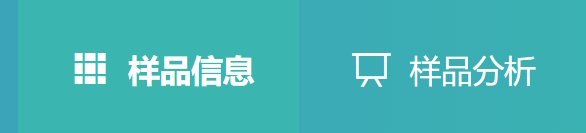

每个目录下分别有一些子页面：

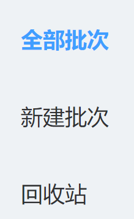

要注意的是`component: () => import('@/views/Batch/index.vue'),`这里，引入的是每个一级目录下的index.vue文件，子目录的信息在index.vue中配置，后面会再提到

```js
const routes = [{
    path: '/',
    name: 'Main',
    component: () => import('@/views/Main.vue'),
    redirect: '/login',
    meta: {login: true},
    children: [
        // 批次及样品数据管理
        {
            path: 'batch',
            component: () => import('@/views/Batch/index.vue'),
            redirect: '/batch/batchList',  // 该配置是若点击选择一级菜单时，默认选中并跳转到该一级菜单下的第一个二级菜单
            children: [ // 子页面
                {
                    path: 'batchList', name: 'batch_batchList',
                    component: () => import('@/views/Batch/BatchList'),
                    meta: {login: true}
                },
                {
                    path: 'detailBatch', name: 'batch_detailBatch',
                    component: () => import('@/views/Batch/DetailBatch'),
                },
               ......
            ]
        },
        ......
    ]
},
    // 一些最顶层的路由，登录注册找回密码等
    {
        path: '/getBackPasswd',
        name: 'getBackPasswd',
        component: () => import('@/views/GetBackPasswd.vue'),
        meta: {login: false}
    },
    {
        path: '/login',
        name: 'login',
        component: () => import('@/views/Login'),
        meta: {login: false}
    },
    {
        path: '/register',
        name: 'register',
        component: () => import('@/views/Register'),
        meta: {login: false}
    }
]
```

### store

存储用户的token信息和语言选择信息

#### index.js

添加user和lang

#### lang.js

cookie中的language字段存储zh或en

#### user.js

cookie中的adminToken存储用户登录后，后端返回的token信息，前端每次向后端发送信息时，都会将这个token加入header，详见下面的utils/api.js

### utils

存储一些用到的工具函数，比如封装的axios和下载cvs文件

#### api.js

##### base：为发送的url，根据情况选一个即可

```js
import axios from "axios";
import store from "../store";

let base = '/api';  // 开发跨域
let base = 'http://localhost:8090/api';   // 部署跨域1，正式
let base = 'http://59.78.194.93:8090/api';  // 部署跨域2，测试
let base = 'http://127.0.0.1:4523/m1/1428114-0-default'
```

##### 封装axios，在其他页面中直接引入调用即可：

```js
export const postJSON = (url, data, params) => {
    store.commit('getToken')
    const token = store.state.user.token
    return axios({
        method: 'post',
        url: `${base}${url}`,
        data: data,
        params: params,
        transformRequest: [function (data) {
            data = JSON.stringify(data);
            return data
        }],
        headers: {
            'Content-Type': 'application/json',
            'Authorization': 'Bearer ' + token
        }
    });
}

export const postFormData = (url, data, params) => {
    store.commit('getToken')
    const token = store.state.user.token
    return axios({
        method: 'post',
        url: `${base}${url}`,
        data: data,
        params: params,
        headers: {
            'Content-type': 'multipart/form-data',
            'Authorization': 'Bearer ' + token
        },
    });
}

export const getFormData = (url, params) => {
    store.commit('getToken')
    const token = store.state.user.token
    return axios({
        method: 'get',
        url: `${base}${url}`,
        params: params,
        headers: {
            'Content-Type': 'multipart/form-data',
            'Authorization': 'Bearer ' + token
        },
        transformRequest: [function (data) {
            data = JSON.stringify(data);
            return data
        }],
    });
}
```

调用：

```js
import {postJSON} from "../../utils/api";
\\ 例如
postJSON('/batch/getBatchListStandard').then((resp) => {
      this.batchListStandard = resp.data.result.batchList
})
```

##### 下载csv文件，在其他页面中直接引入调用即可：

```js
export function downloadCSV(resp, filename) {
    let data = resp.data;  //csv数据
    filename = filename + ".csv";   //导出的文件名
    let type = "";                      //头部数据类型
    let file = new Blob(["\ufeff" + data], {type: type});
    if (window.navigator.msSaveOrOpenBlob)
        // IE10+
        window.navigator.msSaveOrOpenBlob(file, filename);
    else {
        // Others
        let a = document.createElement("a"),
            url = URL.createObjectURL(file);
        a.href = url;
        a.download = filename;
        document.body.appendChild(a);
        a.click();
        setTimeout(function () {
            document.body.removeChild(a);
            window.URL.revokeObjectURL(url);
        }, 0);
    }
}
```

调用：

```js
import {downloadCSV} from "../../utils/api";
\\ 例如
downloadCSV(resp, filename)
```

### components

#### CommonAside.vue

侧边栏目录组件，被引用在一级功能目录（Batch和Analysis）的index.vue文件中，传入menu信息

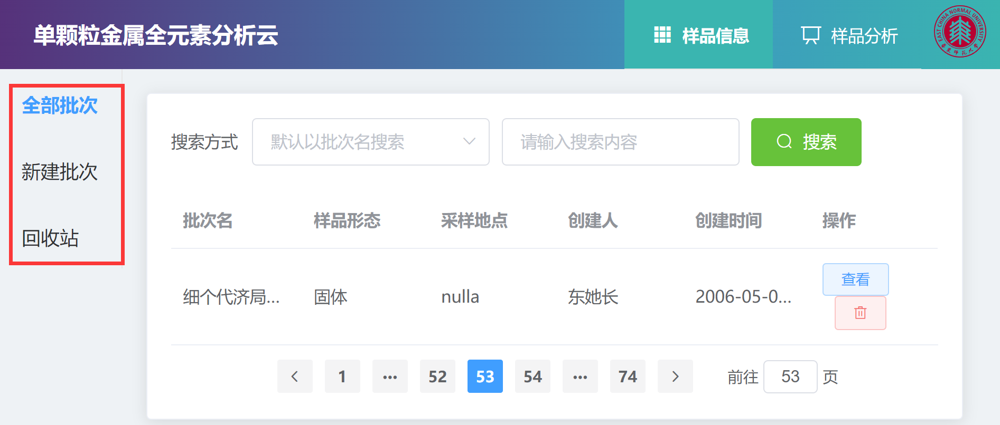

在html中使用：

```html
<common-aside :menu="menu" style="margin-left: -20px"></common-aside>
```

在js中传入信息：

```js
menu: [
    {path: 'batchList', name: 'batch_batchList', label: this.$t('Batch.common.menu.batchList')},
    {path: 'postBatch', name: 'batch_postBatch', label: this.$t('Batch.common.menu.postBatch')},
    {path: 'recycleBin', name: 'batch_recycleBin', label: this.$t('Batch.common.menu.recycleBin')}]
```

#### CommonForm.vue

用户通用表单组件，传入表单信息form

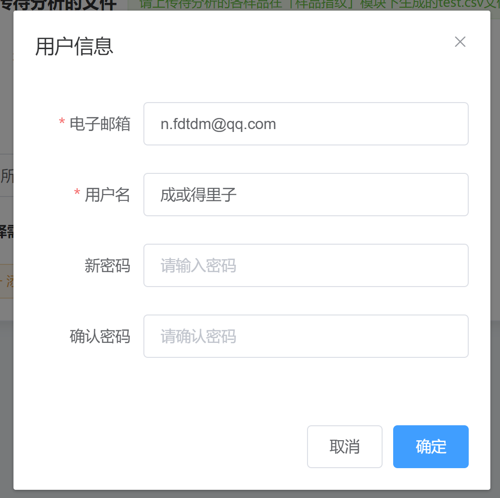

在html中使用：

```html
<common-form ref='form' :form='formData'>
```

在js中传入信息：

```js
formData: {
  id: '',
  name: '',
  email: '',
  password: '',
  passwordConfirm: '',
},
```

#### CommonHeader.vue

顶部信息栏，左侧为系统名称，右侧为一级功能目录”样品信息“和”样品分析“，最右边的华师大校徽点击为”用户信息“和”退出“

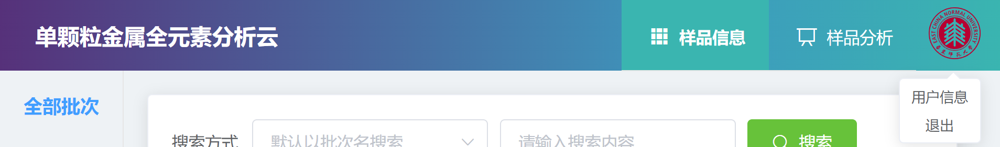

一级功能目录的添加在js的data-menu中：

```js
menu: [
  {
    path: '/batch',
    label: this.$t('CommonHeader.menu.batch'),
    icon: 's-grid',
  },
  {
    path: '/analysis',
    label: this.$t('CommonHeader.menu.analysis'),
    icon: 'data-board',
  }
],
```

#### CommonTable.vue

普通表格组件，只有展示功能

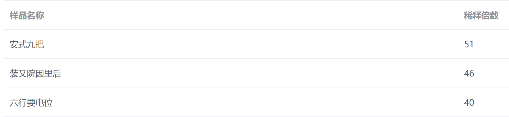

在html中使用，传入table-data和table-label信息：

```js
<common-table :table-data="sampleList.standardSampleList"
              :table-label="tableLabel.standardSample"></common-table>
```

在js中写入信息，注意table-data的字段和table-label要一一对应

#### CommonTableSingle.vue

单选表格组件，单击选择一行

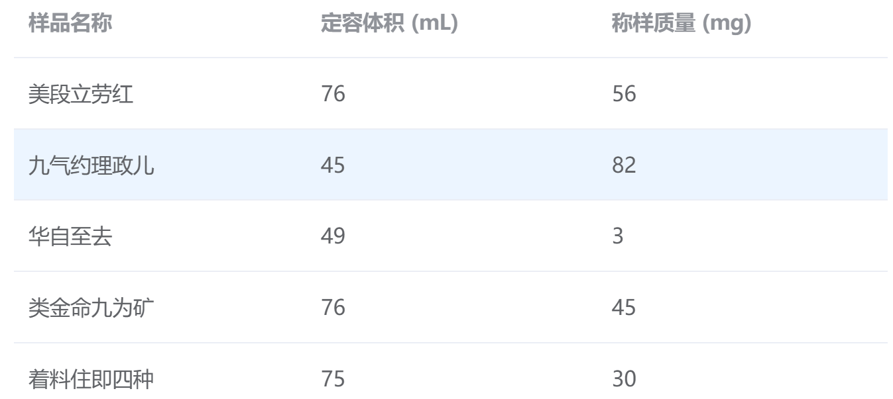

在html中使用，传入table-data和table-label信息，而function字段则说明此时传回的是哪个功能，用于在不同页面中判断是哪个table传回来的值：

```html
<common-table-single :table-data="detectionLimit.sampleList"
                     :table-label="detectionLimit.sampleLabel"
                     function="detectionLimit"
                     @change="resolveBug"></common-table-single>
```

触发`returnSampleIdSingle`事件，function字段说明如上所示：

```js
handleCurrentChange(val) {
  this.currentRow = val;
  this.$bus.$emit('returnSampleIdSingle', {"function": this.function, "sample": this.currentRow});
}
```

在使用该组件的页面中绑定`returnSampleIdSingle`事件并获得返回值：

```js
mounted() {
  this.$bus.$on('returnSampleIdSingle', (data) => {
    if (data.function === 'detectionLimit') {
      this.detectionLimit.sampleId = data.sample.id;
      this.detectionLimit.selectRow = data.sample;
    }
  })
},
```

#### CommonTableMultiple.vue

多选表格组件，可选择多行

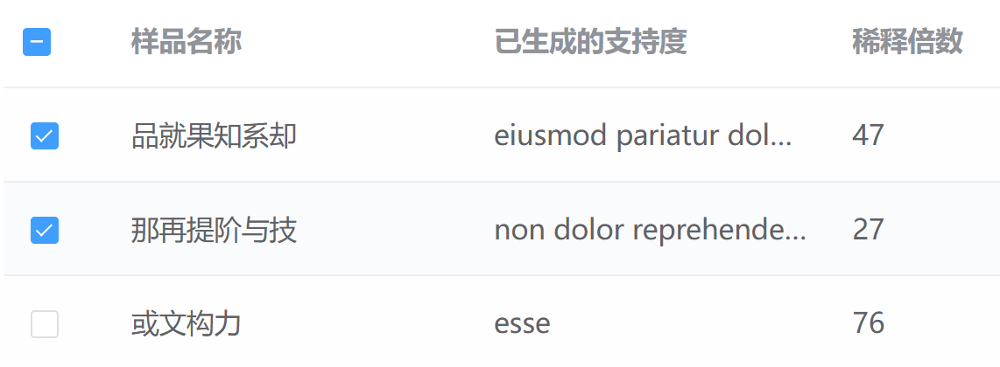

在html中使用，传入table-data和table-label信息，而function字段则说明此时传回的是哪个功能，用于在不同页面中判断是哪个table传回来的值：

```js
props: {
  tableData: Array,
  tableLabel: Array,
  config: Object,
  blueBtn: String,		// 蓝色按钮文字/icon
  redBtn: String,		// 红色按钮文字/icon
  blueBtnShow: String,	// 蓝色按钮是否显示：是，啥也不用传；否，传none
  redBtnShow: String	// 红色按钮是否显示，其他同上
},
```

```html
<common-table-multiple v-if="isReloadData"
                             :table-data="supportX.sampleList"
                             :table-label="supportX.sampleLabel"
                             function="supportX"></common-table-multiple>
```

触发`returnSampleIdMultiple`事件，function字段说明如上所示：

```js
handleSelectionChange(val) {
      this.multipleSelection = val;
      this.$bus.$emit('returnSampleIdMultiple', {"function": this.function, "samples": this.multipleSelection});
}
```

在使用该组件的页面中绑定`returnSampleIdSingle`事件并获得返回值：

```js
mounted() {
  this.$bus.$on('returnSampleIdMultiple', (data) => {
    if (data.function === 'supportX') {
      this.supportX.sampleId = []
      for (let i in data.samples)
        this.supportX.sampleId.push(data.samples[i].id)
      this.supportX.selectRow = data.samples;
    }
  })
},
```

#### CommonTableOperation.vue

操作表格组件，有两个按钮blueBtn和redBtn：

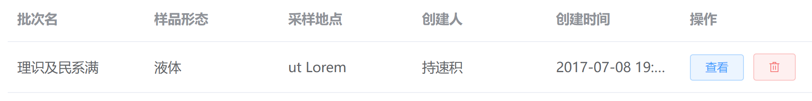

在html中使用，传入table-data和table-label信息，用于在不同页面中判断是哪个table传回来的值：

```html
<common-table-operation :blueBtn="$t('Batch.BatchList.tableOperation.blueBtn')" 
                        :tableData='batchList'
                        :tableLabel='tableLabel'
                        @changePage='search(form.searchType,form.input,currentPage)' 
                        @del='delBatch'
                        @edit='editBatch'></common-table-operation>
```

触发在组件调用时绑定的`edit`和`del`事件（然后分别调用delBatch和editBatch），同时传回选择的行：

```js
handleEdit(row) {
  this.$emit('edit', row)
},
handleDelete(row) {
  this.$emit('del', row)
}
```

### views

#### Batch

##### index.vue

放置该一级目录下的二级目录

组件调用：

```html
<common-aside :menu="menu" style="margin-left: -20px"></common-aside>
```

数据如下：

```js
menu: [
  {path: 'batchList', name: 'batch_batchList', label: this.$t('Batch.common.menu.batchList')},
  {path: 'postBatch', name: 'batch_postBatch', label: this.$t('Batch.common.menu.postBatch')},
  {path: 'recycleBin', name: 'batch_recycleBin', label: this.$t('Batch.common.menu.recycleBin')},
]
```

##### BatchList.vue

用户按照实验的批次上传数据，每次上传一批，详见**PostBatch**

上传后，批次列表展示当前用户所拥有的全部批次，顶部为搜索功能，底部为分页功能，中间为批次列表，每个批次有两个操作：查看和删除

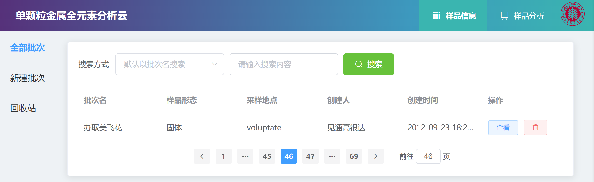

##### RecycleBin.vue

回收站，删除后的批次放入回收站暂存，可选择恢复或彻底删除

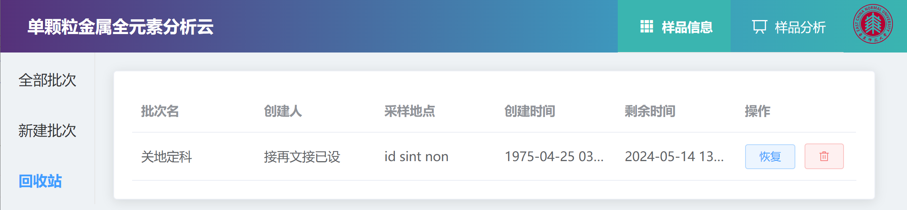

##### DetailBatch.vue

点击批次列表中的查看按钮，进入批次详情页面，展示已上传的每个批次的详细信息，包括**基本信息、参数、5种样品列表**：标准样品、源样品、配置样品、（真实）样品和空白样品

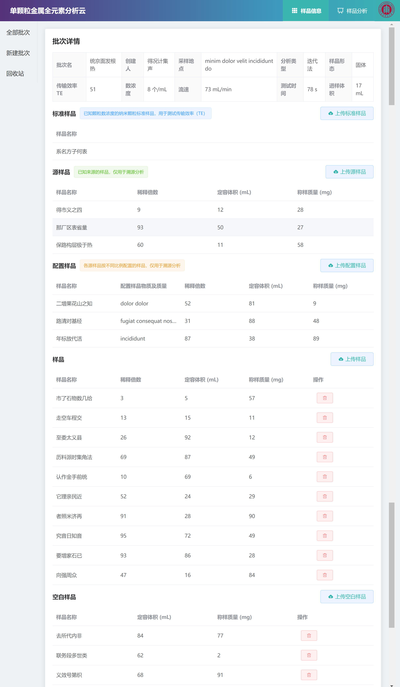

点击每种样品标题右侧的按钮，即可上传各类样品，详见**PostStandardSample、PostSourceSample、PostConfigSample、PostActualSample和PostBlankSample**：

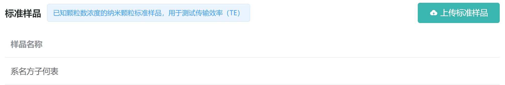

##### PostBatch.vue

新建批次，包括批次的基本信息、实验参数、样品类型和文件上传，这些信息同一批次中的所有样品共用

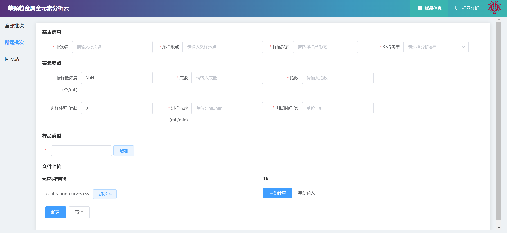

- 基本信息：批次的基本信息，样品形态有固体和液体，不同形态的样品在后面的**Sample**上传部分有不同的参数

- 实验参数：为批次的总指标

  - 标样数浓度：由底数和指数自动计算而来
  - 进样体积：由进样流速和测试时间自动计算而来

- 样品类型：本批次样品中的各类型，如煤灰、土壤、尾气等，点击增加按钮可增加多个传回后端

  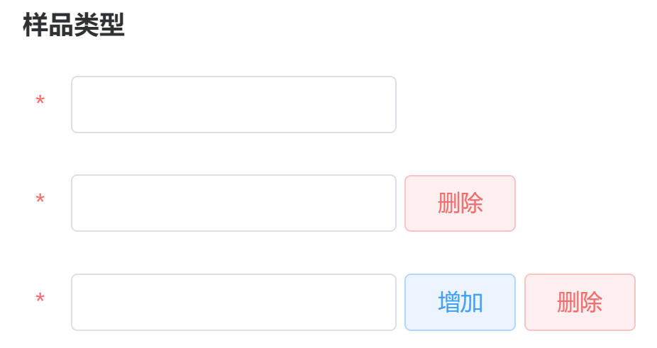

- 文件上传：

  - 元素标准曲线：上传csv，一个文件

  - TE：传输效率，为批次的总指标

    - 选择自动计算，则由上传的批次信息和文件计算
    - 选择手动输入，由用户手动上传该值

    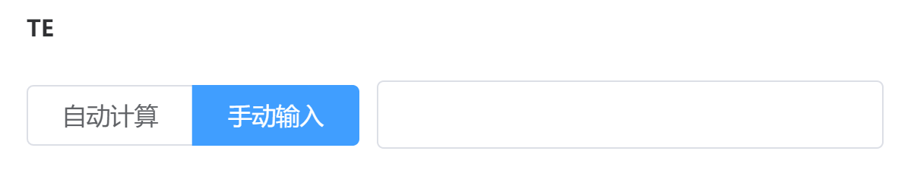

##### Sample

每种批次种有5种样品，下面是各样品的上传页面说明

###### PostStandardSample.vue

标准样品，用于计算TE

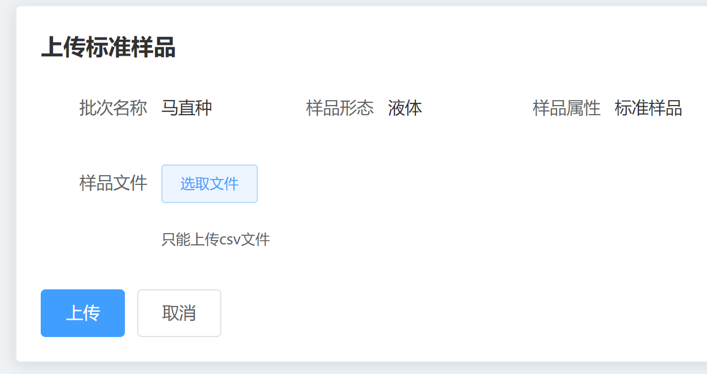

###### PostSourceSample.vue

源样品，用于溯源分析，样品类型为之前在创建批次里输入的内容，例如煤灰、土壤、尾气，分别选择对应的样品类型，输入样品的参数，上传样品文件即可

需要注意的是液体和固体需要输入的参数不同

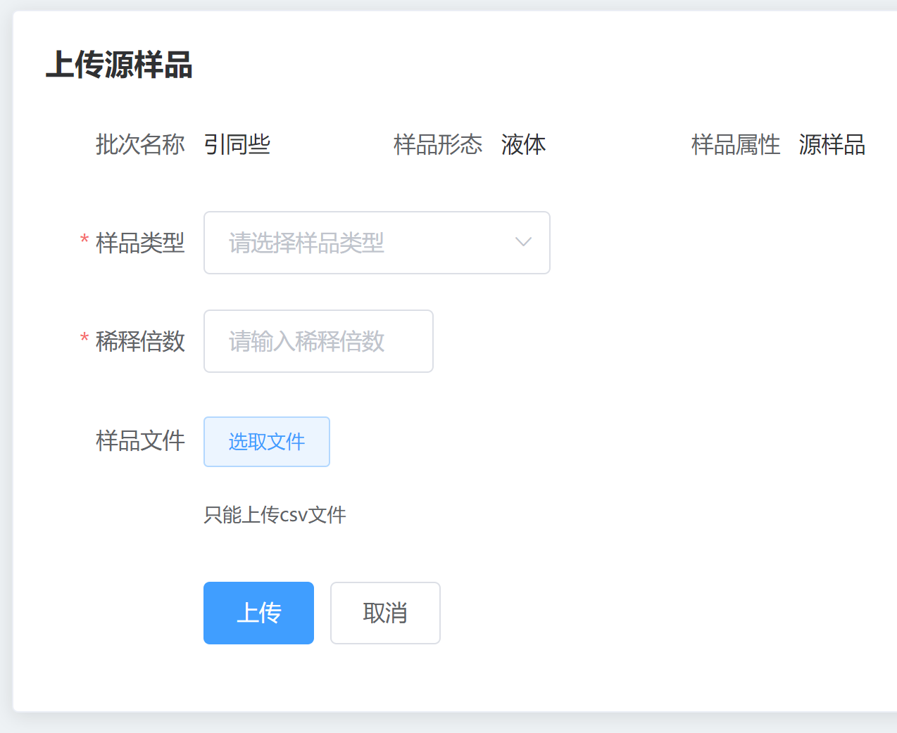

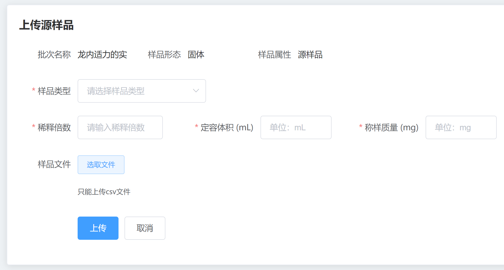

###### PostConfigSample.vue

配置样品，由上面的源样品按不同比例配置而成，需要输入各源样品用到的质量或体积

需要注意的是液体和固体需要输入的参数不同

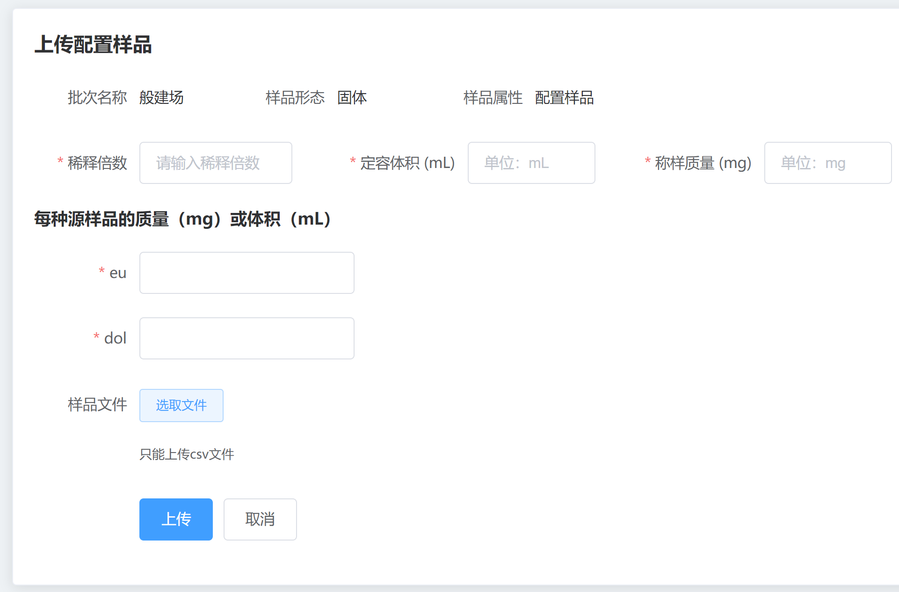

###### PostActualSample.vue

（真实）样品，为在实际环境中采集的样品，只需要输入一些实验参数并上传文件即可

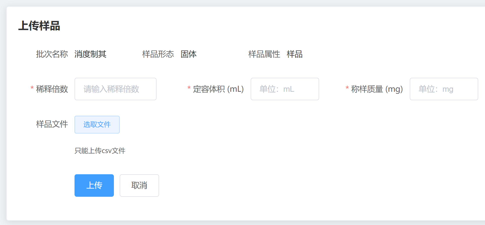

###### PostBlankSample.vue

空白样品，（某种情况下也不知道啥未知的）一种真实样品，也是只需要输入一些实验参数并上传文件即可

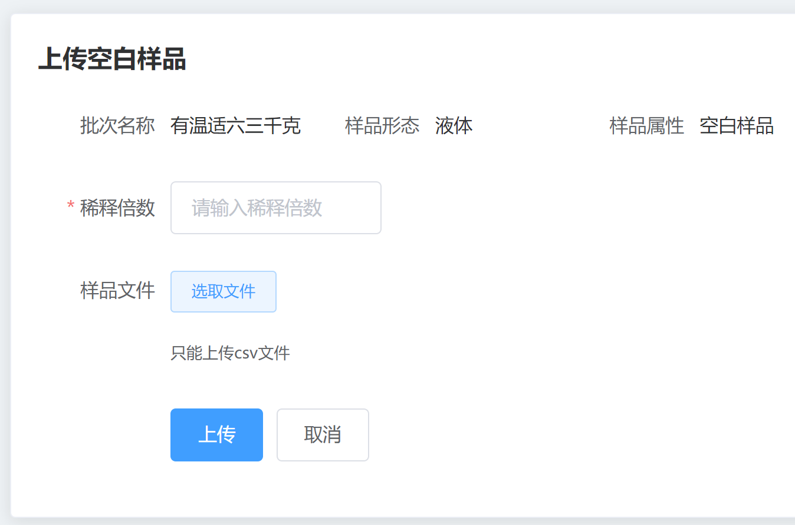

#### Analysis

分析功能，将已上传的各批次样品经由各功能进行分析，流程图如下

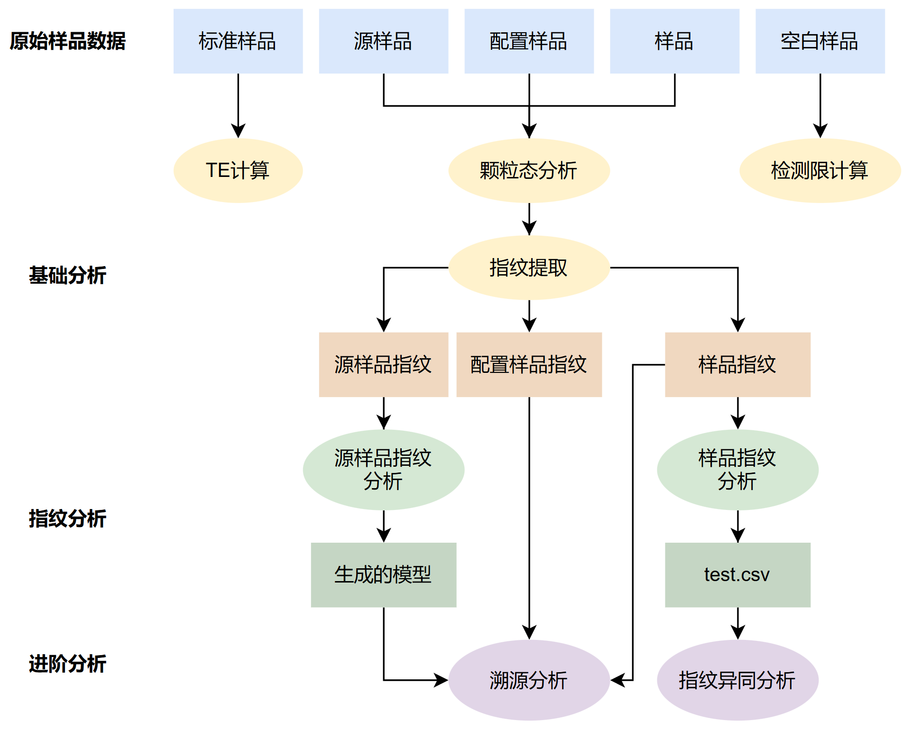

##### index.vue

同上，不再赘述

##### DetectionLimitCalculation.vue

检测限计算，空白样品可计算，分析完后提供文件下载

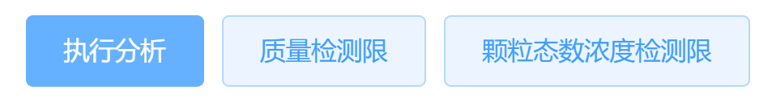

##### Particle.vue

颗粒态分析，源样品、配置样品、样品可计算，分析完后提供一系列文件下载

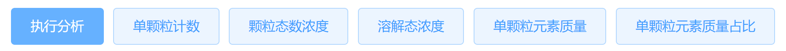

##### Support.vue

指纹提取，源样品、配置样品、样品可计算，可多选样品，输入支持度批量生成多个指纹文件，不同原始样品可通过不同支持度生成多个指纹文件，不会覆盖

注意：源样品的支持度范围在[0.001, 0.009]，配置样品和样品的范围在(0, 1)

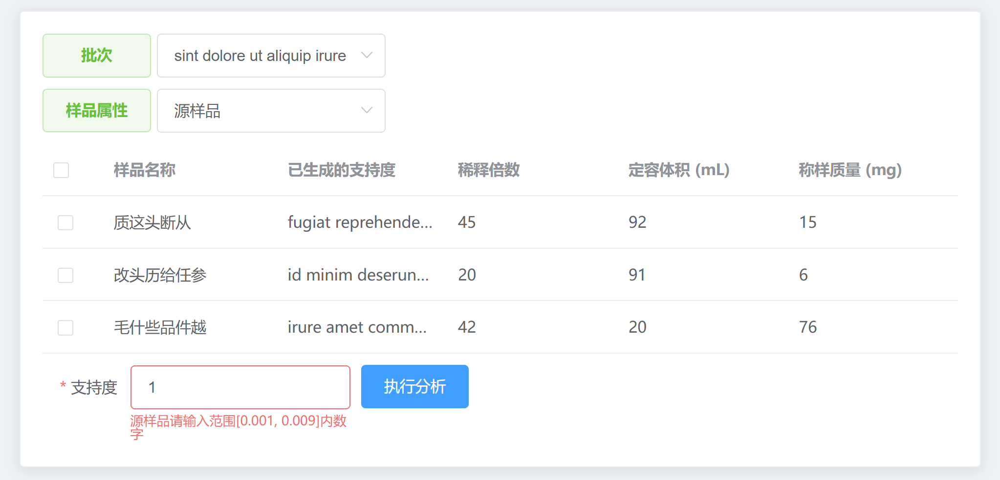

##### AnalysisSource.vue

源样品指纹分析，在指纹提取的基础上才能执行

分组：指纹提取得到源样品指纹后，在创建分组位置依次选择各源样品的指纹（支持度），输入底数，上传配置样品质量配比，即可生成分组。源样品指纹分析后续均在分组的基础上进行。

选择分组，执行下面的分析功能，得到各结果：

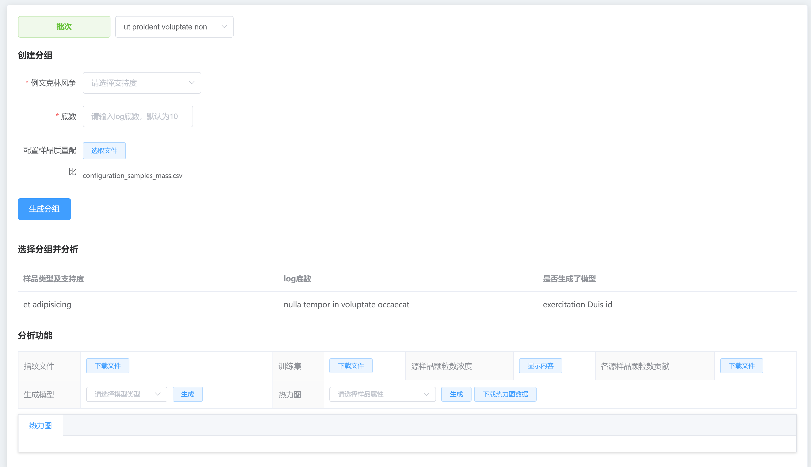

##### AnalysisNotSource.vue

源样品指纹分析，在指纹提取的基础上才能执行

选择配置样品指纹或样品指纹，输入底数，执行下面的分析功能，得到各结果：

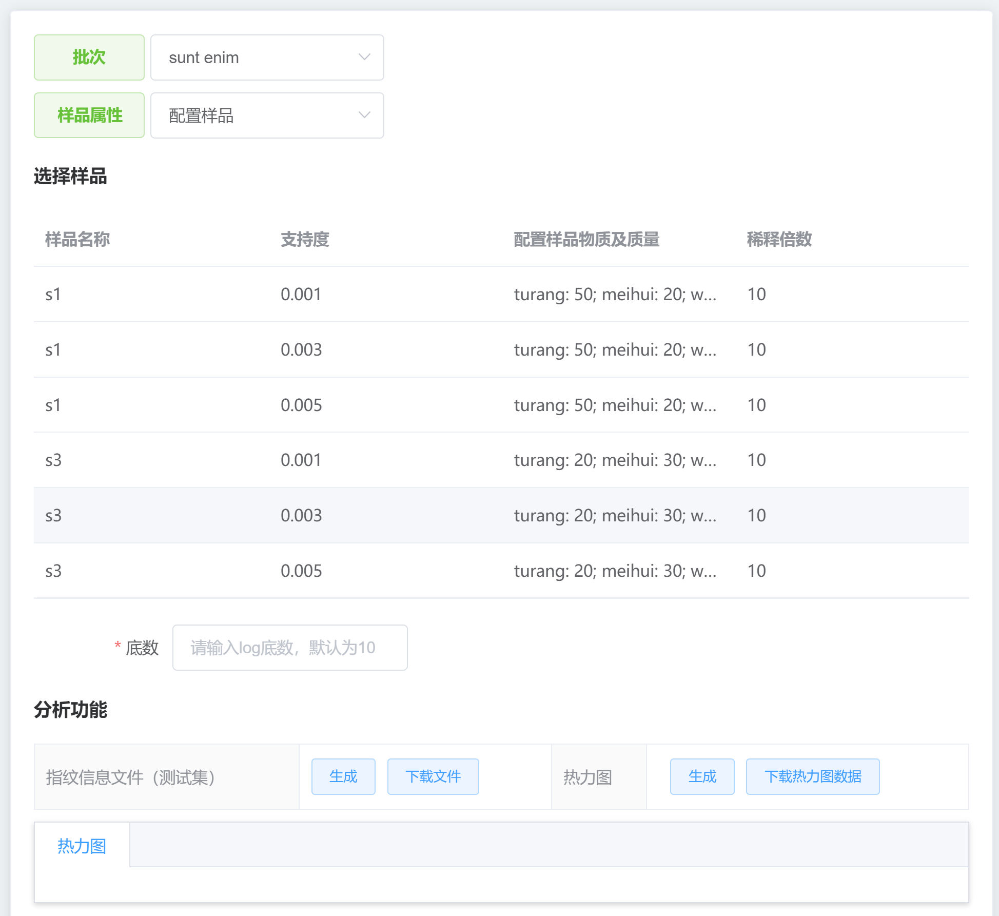

##### TraceabilityAnalysis.vue

溯源分析，使用源样品指纹分析中通过分组生成的对应模型，以及配置样品指纹和样品指纹，生成溯源结果，以此查看模型效果

- 当指纹中选择配置样品时才能生成柱状图，配置样品是标准结果，通过与真实样品的对比，实现对模型效果的观察
- 只有样品无法生成柱状图

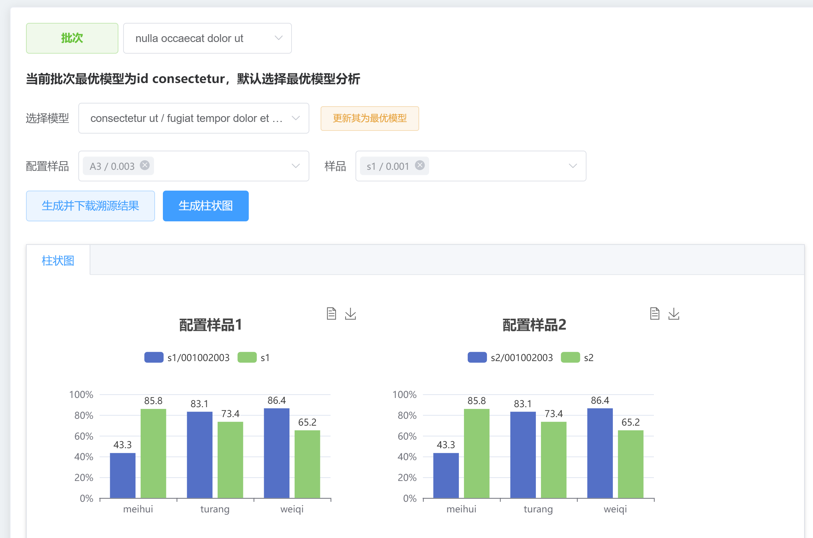

##### FingerprintDiffSame.vue

指纹异同分析，使用各样品在**样品指纹**模块下生成的test.csv文件

选择所有指纹，比较所有上传的文件中的所有元素：

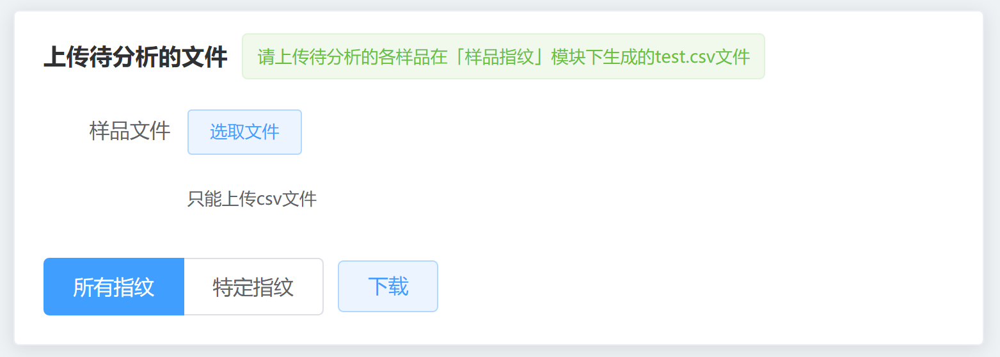

选择特定指纹，添加筛选元素，比较所有上传的文件中的筛选出的元素：

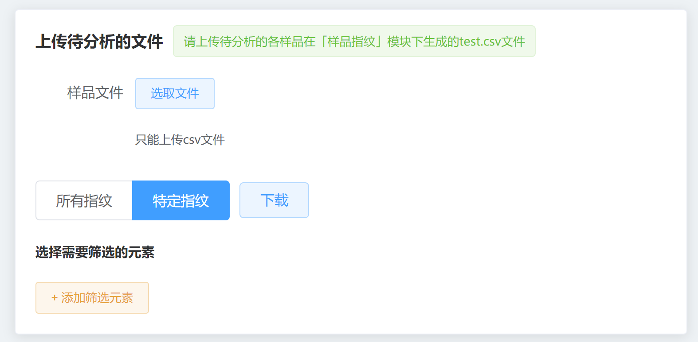

#### Chart

封装echarts的柱状图和热力图

##### BarChart.vue

封装柱状图，由于需求要求返回所有样品类型的柱状图，有好几个，所以使用v-for

```html
<div class="Home">
  <div class="content">
    <!-- v-for 遍历父级div-->
    <div v-for="(item,index) in barChartData.title" :key="index" class="main">
      <!--自定义宽高的dom，用于放置图表-->
      <div class="bar"></div>
    </div>
  </div>
</div>
```

绑定绘制柱状图事件：

```js
mounted() {
  this.$bus.$on("drawBarChart", this.drawBarChart)
},
beforeDestroy() {
  this.$bus.$off('drawBarChart')
},
```

使用时在其他组件中调用如下：

```html
<BarChart></BarChart>
```

同时触发绘图事件，传入溯源结果csv文件的url：

```js
generateBarChart() {
  this.tabActiveName = "BarChart"
  this.$bus.$emit("drawBarChart", {url: this.traceResultCSVUrl})
},
```

##### HeatMap.vue

封装热力图，热力图在多个页面中都有调用，一定要使用不同id区分，否则会有bug：

```html
<!-- 组件复用导致的数据覆盖，使用不同id进行区分，或使用ref进行初始化 -->
<div :id="HeatMapId"
     ref="Heat_Map"
     :style="{width: heatMapDivWidth + 'px', height: heatMapDivHeight + 'px'}"></div>
```

传入的数据是heat-map-info（调用该组件的页面事先获取并传入）和heat-map-id（起一个不和其他HeatMap重复的id）

```html
<HeatMapSource :heat-map-info="heatMapInfo" heat-map-id="heatMapSource"></HeatMapSource>
```

```js
import HeatMapSource from "../Chart/HeatMap";
```

#### Login.vue

登录页面，使用电子邮箱登录

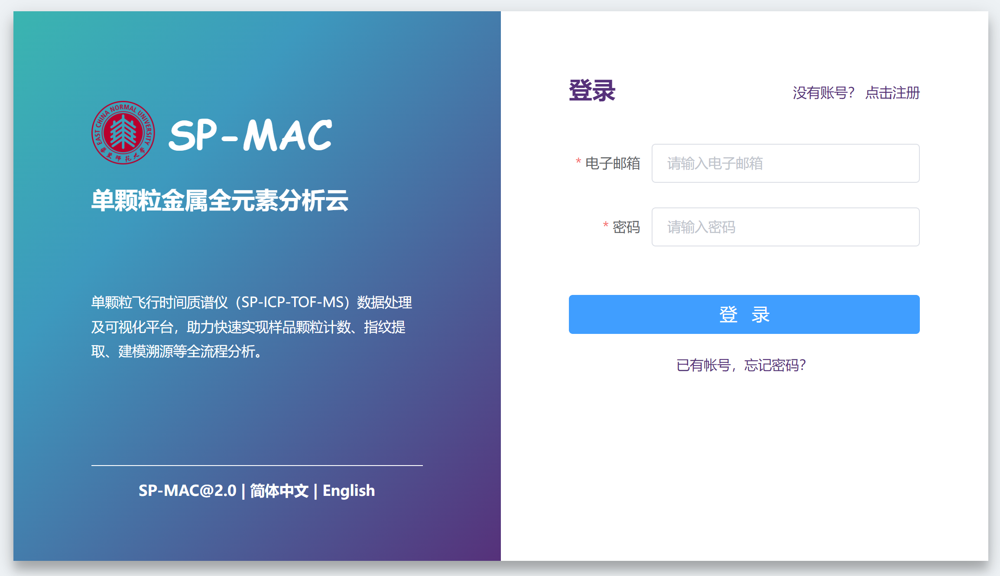

登录成功后返回用户的token，存入cookie

```js
this.$store.commit('setToken', resp.data.result)
```

在页面左侧点击**简体中文**或**English**切换语言，代码如下：

```js
handleSetLanguage(lang) {
  this.$i18n.locale = lang
  this.$store.commit('setLanguage', lang)
  this.reload() // fix语言切换后，element-ui弹窗提示文字不能切换，必须强制刷新页面才能解决的bug
},
```

#### Register.vue

注册页面，使用电子邮箱注册，并向邮箱发送验证码

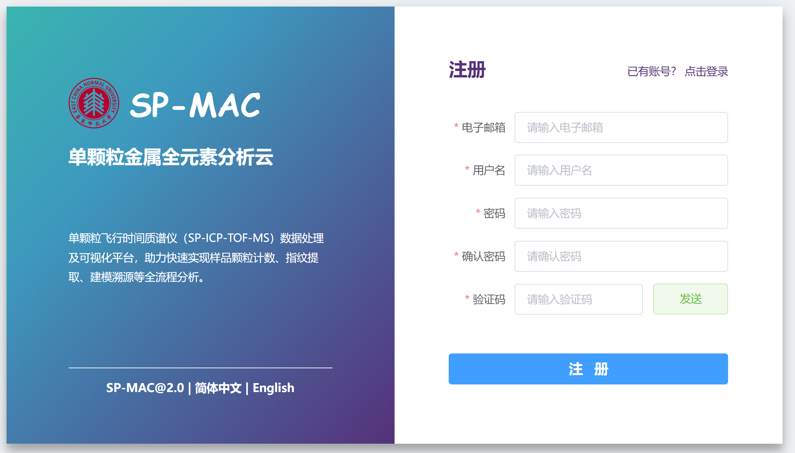

#### GetBackPasswd.vue

找回密码页面，向邮箱发送验证码找回

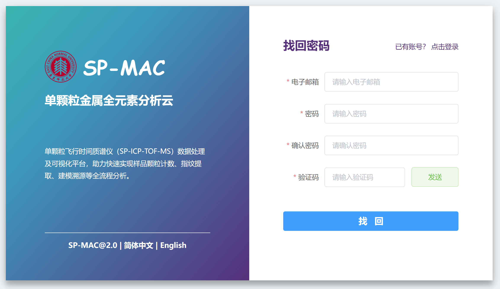

#### Main.vue

放置common-header、el-container，为主要布局

### App.vue

下面这一行配置的是路由跳转页面就刷新：

```html
<router-view :key="$route.query"></router-view>
```

### main.js

引入一些项目必备的组件，下面内容规定了全局路由跳转，当未登录却访问需要登录的页面时，跳转回登录等页面：

```js
router.beforeEach((to, from, next) => {
    store.commit('getToken');
    const token = store.state.user.token
    if (!token && to.name === 'register') {
        next()
    } else if (!token && to.name === 'getBackPasswd') {
        next()
    } else if (!token && to.name !== 'login') {
        next({
            name: 'login'
        })
    } else if (token && (to.name === 'login' || to.name === 'register')) {
        next({path: "batch"})
    } else {
        next()
    }
})
```

## vue.config.js

打包用不到这个文件，本地serve时用于解决跨域问题，详情看**03部署部分**